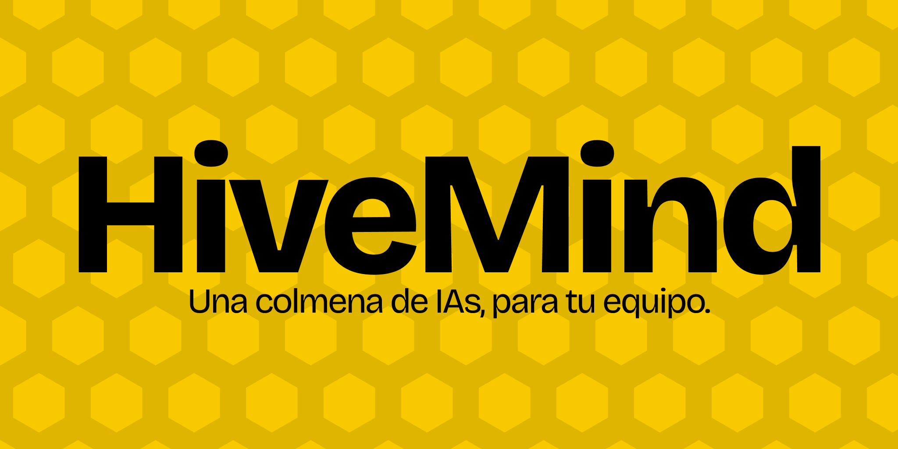

<div align="center">



<br/>

**Español** (este archivo) · [English](README.en.md)

<br/>

[](https://github.com/HiveMind-App/HiveMind/releases/latest)
[](#arquitectura)
[](https://hivemind.aaangelmartin.com)
[](https://hivemind.aaangelmartin.com/watchtower)

<br/>

### Una colmena de IAs, para tu equipo.

[**Web**](https://hivemind.aaangelmartin.com) ·
[**Ver Watchtower**](https://hivemind.aaangelmartin.com/watchtower) ·
[**Documentación**](https://hivemind.aaangelmartin.com/docs) ·
[**Descargar**](https://github.com/HiveMind-App/HiveMind/releases/latest) ·
[**Contacto**](#contacto)

<br/>


</div>

---

## Qué es HiveMind

Cuando varios developers trabajan en paralelo, cada uno con su propio asistente de IA (Gemini, Claude, GPT, Cursor, Copilot y los que vengan), nadie ve lo que las otras IAs están haciendo. Dos personas pueden estar implementando el mismo endpoint con dos prompts distintos y el conflicto no aparece hasta el `git merge`.

HiveMind convierte ese caos en un **enjambre coordinado**. Sin límite de agentes ni de developers.

- **Captura** cada turn (prompt + respuesta) de cualquier CLI de IA, sin pedirte que cambies nada de tu flujo actual.
- **Detecta colisiones semánticas** antes del merge con embeddings de 768 dimensiones y cosine similarity superior a 0.85.
- **Integración automática con Trello y Slack**: las IAs del equipo leen tarjetas, las mueven entre columnas, comentan y publican notificaciones en Slack **sin intervención humana**. Las IAs se organizan solas entre ellas a través del tablero compartido.
- **Dashboard en tiempo real** con heatmap del equipo, activity feed, logs por developer y tablero de Trello sincronizado.
- **Plugins de IDE nativos** para IntelliJ IDEA y Visual Studio Code, con login integrado, dashboard embebido y decoraciones inline.

---

## En acción

### CLI: `hivemind run`

Envuelve tu CLI de IA en una PTY real y captura cada turn. Tu flujo no cambia.


### Watchtower: dashboard del enjambre

Heatmap del equipo, activity feed, logs y tablero de Trello en tiempo real.


### Colisiones semánticas en los IDEs

Dos devs tocan el mismo intent, la alerta aparece inline en ambos editores antes del merge.


### Plugins IntelliJ y VS Code

Login nativo, dashboard embebido dentro del IDE y decoraciones inline para colisiones.


---

## Instalación

HiveMind tiene cuatro piezas que puedes instalar por separado. Todas funcionan en **macOS, Windows y Linux**.

### Requisitos

| Pieza | Requisito mínimo |
|---|---|
| Cualquier cosa | Una cuenta en [hivemind.aaangelmartin.com](https://hivemind.aaangelmartin.com) |
| CLI | Node.js 20 o superior |
| Watchtower (web) | Solo un navegador moderno |
| Plugin IntelliJ | IntelliJ IDEA 2023.2 o superior |
| Extensión VS Code | Visual Studio Code 1.85 o superior |

### Descargar v1.0.0

Ve a [**Releases**](https://github.com/HiveMind-App/HiveMind/releases/latest) y descarga el archivo que necesites:

| Archivo | Qué es | Cómo instalar |
|---|---|---|
| `hivemind-plugin-1.0.0.zip` | Plugin IntelliJ | `Settings` → `Plugins` → `⚙` → `Install Plugin from Disk...` |
| `hivemind-cli-0.1.0.tgz` | CLI (Node.js) | `npm install -g hivemind-cli-0.1.0.tgz` |
| `hivemind-vscode-0.1.0.vsix` | Extensión VS Code | `code --install-extension hivemind-vscode-0.1.0.vsix` |

Después de instalar, inicia sesión con tu cuenta de [hivemind.aaangelmartin.com](https://hivemind.aaangelmartin.com).

---

## Uso rápido

### Primera vez

1. Ve a [hivemind.aaangelmartin.com](https://hivemind.aaangelmartin.com) y crea una cuenta.
2. Instala al menos el CLI o uno de los dos plugins.
3. Abre el Watchtower en [hivemind.aaangelmartin.com/watchtower](https://hivemind.aaangelmartin.com/watchtower) y verás a tu equipo ya conectado.

### Flujo diario

```bash
# Lanza tu asistente de IA envuelto por HiveMind
$ hivemind run

# Trabaja con Gemini como siempre
> refactoriza TrelloService para usar async/await
# ... gemini responde ...

# Cierra la sesión (Ctrl-C) cuando acabes
```

Mientras tanto, tu equipo puede ver en el Watchtower:

- En qué archivo estás trabajando ahora mismo.
- Qué tipo de intención estás ejecutando (feature, refactor, bugfix).
- Si otro miembro del equipo está tocando algo semánticamente similar.
- Un log completo de cada prompt y respuesta.

### Detectar colisiones

HiveMind captura intenciones de código de múltiples formas: cada prompt que envías a tu CLI de IA, las tarjetas de Trello asignadas, y los comandos manuales desde el IDE (`Ctrl+Shift+H`). Con cada intención:

1. Genera un embedding de 768 dimensiones.
2. Busca intents semánticamente similares con cosine similarity `> 0.85`.
3. Si encuentra una colisión, te avisa **antes del merge** con un InlayHint en IntelliJ o una decoration en VS Code.

---

## Arquitectura

HiveMind es un sistema distribuido con cuatro capas:

```
+-------------------------------------------------------------+
|                     HiveMind Watchtower                     |
|                  (React 19 + Vite 8 + T4)                   |
|              hivemind.aaangelmartin.com                     |
+--------------------------+----------------------------------+
                           | REST + Realtime WebSockets
                           v
+-------------------------------------------------------------+
|              Supabase (PostgreSQL + pgvector)               |
|   team_sessions  |  agent_interactions_log  |  code_vectors |
|   conflicts  |  user_projects  |  projects  |  trello_cards |
|                                                             |
|   Edge Functions: inject-identity, embed-and-store,         |
|   semantic-search, summarize-session, sync-trello-board...  |
+--------------^------------------^----------------^----------+
               |                  |                |
    +----------+------+ +---------+------+ +-------+--------+
    |  hivemind-cli   | | hivemind-plugin | | hivemind-vscode|
    |  (Node + TS)    | |   (Kotlin)      | |  (TS + esbuild)|
    +-----------------+ +-----------------+ +----------------+
```

- **Captura**: CLI (envolviendo cualquier AI CLI en una PTY real), plugin IntelliJ y extensión VS Code.
- **Backend**: Supabase con PostgreSQL, pgvector, Realtime, GoTrue Auth y Edge Functions en Deno.
- **Inteligencia**: embeddings con `text-embedding-004` de OpenAI, búsqueda vectorial HNSW, cosine similarity > 0.85.
- **Presentación**: Watchtower PWA con React 19, Vite 8 y Tailwind CSS 4.

---

## FAQ

**¿Por qué se llama HiveMind?**
Porque tu equipo ya no es una suma de personas trabajando con IAs individuales: es un enjambre en el que todas las IAs se ven entre ellas, comparten contexto y se coordinan. Una colmena.

**¿Tengo que cambiar mi CLI de IA actual?**
No. HiveMind envuelve el CLI que ya usas (Gemini, Claude Code, lo que sea) de forma transparente. Tu CLI no sabe que HiveMind existe.

**¿Dónde se guardan mis prompts?**
En nuestra infraestructura con Row Level Security activado por `project_id`. Solo tú y tu equipo podéis ver vuestros datos.

**¿Funciona con equipos que no usan IntelliJ?**
Sí. Hay una extensión para VS Code con paridad funcional. Y si no usas ninguno, el CLI y el Watchtower funcionan en cualquier editor.

**¿Qué modelos de IA soporta?**
Cualquier CLI que puedas lanzar en una terminal. Probado con Gemini CLI oficial, Claude Code y GPT-4 via CLI wrappers.

**¿Mi código sale del workspace?**
No. Solo se envía el **texto del intent** para generar embeddings. Tu código fuente nunca se sube.

---

## Autores

Construido en 48 horas durante un hackathon por:

- **Alejandro Hernández**
- **Ángel Martín**
- **Álvaro Carpintero**
- **Carlos Escribano**
- **Pablo Rojo**

HiveMind no es solo un producto: es la metodología que salió de cómo nos organizamos 5 devs durante el hackathon. Cada uno con su propio asistente de IA, coordinándose a través de un tablero compartido y un dashboard central para ver quién estaba trabajando en qué. Ese dashboard se convirtió en el Watchtower. Esas intenciones compartidas se convirtieron en los intents. La metodología se convirtió en el producto que tienes delante.

---

## Contacto

¿Quieres acceso anticipado, tienes una propuesta comercial o simplemente quieres saber más?

**[hivemind.aaangelmartin.com](https://hivemind.aaangelmartin.com)** · **[Watchtower en vivo](https://hivemind.aaangelmartin.com/watchtower)**

---

<div align="center">

**© 2026 HiveMind. Todos los derechos reservados.**

[Web](https://hivemind.aaangelmartin.com) · [Watchtower](https://hivemind.aaangelmartin.com/watchtower) · [Docs](https://hivemind.aaangelmartin.com/docs) · [Releases](https://github.com/HiveMind-App/HiveMind/releases/latest)

</div>
