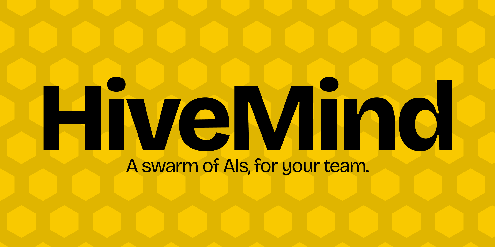

<div align="center">



<br/>

[](LICENSE)
[](#architecture)
[](https://nodejs.org)
[](https://github.com/HiveMind-App/HiveMind)

<br/>

### A swarm of AIs, for your team.

[**Report a bug**](https://github.com/HiveMind-App/HiveMind/issues) ·
[**Discussions**](https://github.com/HiveMind-App/HiveMind/discussions) ·
[**Releases**](https://github.com/HiveMind-App/HiveMind/releases)

<br/>


</div>

---

## What is HiveMind

When multiple developers work in parallel, each with their own AI assistant (Gemini, Claude, GPT, Cursor, Copilot and whatever comes next), nobody sees what the other AIs are doing. Two people can be implementing the same endpoint with two different prompts and the conflict only surfaces at `git merge`.

HiveMind turns that chaos into a **coordinated swarm**. No limit on agents or developers.

- **Captures** every turn (prompt + response) from any AI CLI without asking you to change your flow.
- **Detects semantic collisions** before merge with 768-dimension embeddings and cosine similarity above 0.85.
- **Automatic Trello and Slack integration**: the team's AIs read cards, move them across columns, comment and post change notifications to Slack **without human intervention**. The AIs coordinate with each other through the shared board.
- **Real-time dashboard** with team heatmap, activity feed, per-developer logs and synced Trello board.
- **Native IDE plugins** for IntelliJ IDEA and Visual Studio Code, with built-in login, embedded dashboard and inline decorations.
- **100% open-source under AGPL v3**: auditable, forkable and self-hostable.

---

## In action

### CLI: `hivemind run`

Wraps your AI CLI in a real PTY and captures every turn. Your flow does not change.


### Watchtower: swarm dashboard

Team heatmap, activity feed, logs and synced Trello board in real time.


### Semantic collisions inside the IDEs

Two devs touch the same intent. The warning appears inline in both editors before merge.


### IntelliJ and VS Code plugins

Native login, dashboard embedded inside the IDE and inline decorations for collisions.


---

## Table of contents

- [Installation](#installation)
- [Quick start](#quick-start)
- [Architecture](#architecture)
- [Components](#components)
- [Configuration](#configuration)
- [FAQ](#faq)
- [Contributing](#contributing)
- [License](#license)

---

## Installation

HiveMind has three pieces that you can install independently. All of them can coexist with your current flow and work on **macOS, Windows and Linux**.

### Requirements

| Piece | Minimum |
|---|---|
| CLI | Node.js 20 or newer |
| IntelliJ plugin | IntelliJ IDEA 2023.2 or newer (Community or Ultimate) |
| VS Code extension | Visual Studio Code 1.85 or newer |
| CLI + Gemini | [Gemini CLI](https://github.com/google-gemini/gemini-cli) installed (`npm i -g @google/gemini-cli`) |

### Install from Releases (recommended)

Go to [**Releases**](https://github.com/HiveMind-App/HiveMind/releases/latest) and download what you need:

| File | What it is | How to install |
|---|---|---|
| `hivemind-plugin-*.zip` | IntelliJ plugin | IntelliJ → `Settings` → `Plugins` → `⚙` → `Install Plugin from Disk...` → select the .zip |
| `hivemind-cli-*.tgz` | CLI (Node.js) | `npm install -g hivemind-cli-*.tgz` |
| `hivemind-vscode-*.vsix` | VS Code extension | `code --install-extension hivemind-vscode-*.vsix` |

### Install from source

<details>
<summary>CLI (<code>hivemind</code>)</summary>

The CLI wraps the AI assistant you already use. It captures turns and syncs them to the Watchtower.

```bash
git clone https://github.com/HiveMind-App/HiveMind.git
cd HiveMind
npm install && npm run build
npm link              # registers the `hivemind` command globally
hivemind init
hivemind run
```

`hivemind run` launches your AI CLI inside a real PTY and syncs every prompt and response in real time. Your flow does not change at all: colors, autocomplete and shortcuts keep working exactly the same.

</details>

<details>
<summary>IntelliJ plugin</summary>

You need JDK 17 and Gradle 8.

```bash
cd hivemind-plugin
./gradlew buildPlugin

# Plugin output: build/distributions/hivemind-plugin-*.zip
```

1. Open IntelliJ IDEA.
2. `Settings` → `Plugins` → `⚙` → `Install Plugin from Disk...`
3. Select the generated `.zip` from `hivemind-plugin/build/distributions/`.
4. Restart the IDE.
5. Open the **HiveMind** tool window on the right sidebar and log in.

> For quick development: `./gradlew runIde` launches an IntelliJ sandbox with the plugin already loaded.

</details>

<details>
<summary>VS Code extension</summary>

```bash
cd hivemind-vscode
npm install
npm run build
```

**Option A — Dev mode:**

```bash
code --extensionDevelopmentPath="$(pwd)"
```

**Option B — Package as .vsix:**

```bash
npx @vscode/vsce package
code --install-extension hivemind-vscode-*.vsix
```

</details>

---

## Quick start

### First time

1. Clone this repo and install the CLI or one of the IDE plugins (see [Installation](#installation)).
2. Copy `.env.example` to `.env` and fill in your Supabase credentials:

```bash
cp .env.example .env
```

3. Run `hivemind init` to authenticate and configure your workspace.

### Daily flow

```bash
# Launch your AI assistant wrapped by HiveMind
$ hivemind run

# Work with Gemini (or any AI CLI) as usual
> refactor TrelloService to use async/await
# ... the AI responds ...

# Close the session (Ctrl-C) when you are done
```

### Commands

| Command | Description |
|---|---|
| `hivemind init` | First-time setup. Authenticates and saves credentials to `~/.hivemind/config.json`. |
| `hivemind login` | Renew your session without re-running init. |
| `hivemind logout` | Clear local session. Use `--full` to wipe the entire config. |
| `hivemind run` | Launch your AI CLI wrapped in a PTY. Every turn is intercepted and synced to Supabase. |
| `hivemind pull-context` | Download the team system prompt (role, current task, team snapshot). |
| `hivemind status` | Show current config and backend connectivity. |
| `hivemind mcp` | Start the MCP server in stdio mode (auto-discovered by Gemini CLI). |

### Detecting collisions

HiveMind captures code intentions from every prompt you send to your AI CLI. For each intention:

1. Generates a 768-dimension embedding.
2. Searches for semantically similar intents with cosine similarity `> 0.85`.
3. If it finds a collision, it warns you **before merge** with an InlayHint in IntelliJ or a decoration in VS Code.

You do not have to configure anything. The system does it automatically while you work.

---

## Architecture

HiveMind is a distributed system with four layers:

```
+-------------------------------------------------------------+
|                     HiveMind Watchtower                     |
|                  (React 19 + Vite 8 + TW4)                  |
+--------------------------+----------------------------------+
                           | REST + Realtime WebSockets
                           v
+-------------------------------------------------------------+
|              Supabase (PostgreSQL + pgvector)               |
|   team_sessions  |  agent_interactions_log  |  code_vectors |
|   conflicts  |  user_projects  |  projects  |  trello_cards |
|                                                             |
|   Edge Functions: inject-identity, embed-and-store,         |
|   semantic-search, summarize-session, sync-trello-board...  |
+--------------^------------------^----------------^----------+
               |                  |                |
    +----------+------+ +---------+------+ +-------+--------+
    |  hivemind-cli   | | hivemind-plugin | | hivemind-vscode|
    |  (Node + TS)    | |   (Kotlin)      | |  (TS + esbuild)|
    +-----------------+ +-----------------+ +----------------+
```

- **Capture**: CLI (wrapping any AI CLI in a real PTY), IntelliJ plugin (`DocumentListener`) and VS Code extension (`onDidChangeTextDocument`).
- **Backend**: Supabase with PostgreSQL, pgvector, Realtime, GoTrue Auth and Deno Edge Functions.
- **Intelligence**: embeddings with OpenAI `text-embedding-004`, vector search with HNSW over pgvector, cosine similarity > 0.85 to fire the alert.
- **Presentation**: Watchtower PWA with React 19, Vite 8 and Tailwind CSS 4.

---

## Components

| Folder | Stack | Purpose |
|---|---|---|
| [`src/`](src/) | Node 20+, TypeScript, `@lydell/node-pty`, MCP SDK | CLI source — wraps your AI CLI and captures turns |
| [`hivemind-vscode/`](hivemind-vscode/) | TypeScript, esbuild, VS Code API | VS Code extension with functional parity |
| [`hivemind-plugin/`](hivemind-plugin/) | Kotlin 1.9, IntelliJ Platform 2023.2.5, JCEF | IntelliJ plugin with login and embedded dashboard |

---

## Configuration

### CLI

The CLI reads from `.env` at the project root or from `~/.hivemind/config.json` after login.

| Variable | Description |
|---|---|
| `HIVEMIND_SUPABASE_URL` | Your Supabase project URL |
| `HIVEMIND_SUPABASE_ANON_KEY` | Your Supabase anon key |

```bash
hivemind init       # interactive setup
hivemind whoami     # show current session
```

### IntelliJ plugin / VS Code extension

| Setting | Default | Description |
|---|---|---|
| `Supabase URL` | — | Your Supabase instance |
| `Project ID` | (empty) | Project UUID from `hivemind init` |

If your organization runs HiveMind self-hosted, point the URL to your company domain.

---

## FAQ

**Do I need to change my current AI CLI?**
No. HiveMind wraps the CLI you already use (Gemini, Claude Code, whatever) in a real PTY and captures every turn transparently. Your CLI has no idea HiveMind exists.

**Where are my prompts stored?**
In your Supabase instance, with Row Level Security enabled by `project_id`. The entire stack is open-source: you can self-host Supabase and point every plugin to your domain.

**Does it work if my team doesn't use IntelliJ?**
Yes. There is a VS Code extension with functional parity. If you use neither, the CLI alone is enough to sync to the hive.

**Can I self-host it?**
Yes. Supabase is open-source, the CLI is pure TypeScript, the plugins are Kotlin and TypeScript. Clone the repo, spin up local Supabase, configure the plugins to point to your URL and you are done.

**Which AI models does it support?**
Any CLI you can launch in a terminal. Tested with the official Gemini CLI, Claude Code and GPT-4 via CLI wrappers. Embeddings default to OpenAI `text-embedding-004`.

**Does my code leave the workspace?**
No. Only the **intent text** (the prompt or task description) is sent to generate embeddings. Your source code never leaves.

---

## Contributing

Pull requests are welcome. For big changes, please open an [issue](https://github.com/HiveMind-App/HiveMind/issues) first to discuss the approach.

```bash
git clone https://github.com/HiveMind-App/HiveMind.git
cd HiveMind

# CLI
npm install && npm run build

# VS Code extension
cd hivemind-vscode && npm install && npm run build

# IntelliJ plugin
cd hivemind-plugin && ./gradlew buildPlugin
```

Before opening a PR:

- `npm run typecheck` in the root
- `npm run typecheck` in `hivemind-vscode/`
- `./gradlew test` in `hivemind-plugin/`

---

## License

**GNU Affero General Public License v3.0**. See [`LICENSE`](LICENSE).

You can use, modify and redistribute HiveMind freely. The only relevant condition: any modified version you expose over the network (SaaS, public API, etc.) must also publish its source code under AGPL v3.

---

<div align="center">

[**A swarm of AIs, for your team.**](https://github.com/HiveMind-App/HiveMind)

[GitHub](https://github.com/HiveMind-App/HiveMind) · [Issues](https://github.com/HiveMind-App/HiveMind/issues) · [Releases](https://github.com/HiveMind-App/HiveMind/releases)

</div>
